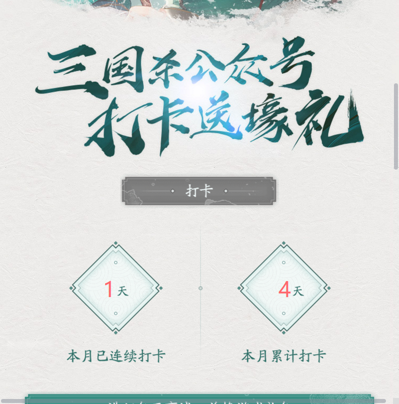
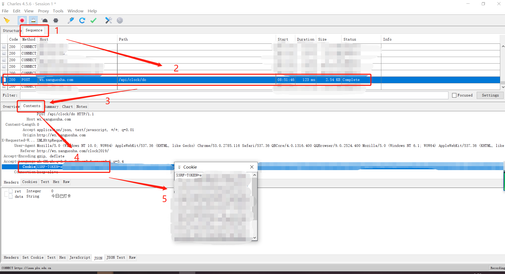

# SGS-WECHATAUTOCLOCK

微信三国杀公众号快速打卡工具 （我的第一个应用层网络编程试水QAQ）

### 使用方法：
首次使用需要获取cookie，在当前目录下新建```cookie.txt```并保存到其中，获取教程见后文。

```sh
$ python sgs.py
```
可能的输出：
```
{'ret': 0, 'data': '今日已打卡'}
```
通常，```ret```为0即表示打卡成功。

### cookie获取教程
目前只发现了通过抓包软件的获取方法。此处以抓包软件[Charles](https://www.charlesproxy.com/)为例：

运行Charles并开始监视，然后在电脑端微信进入“三国杀”公众号，进入打卡界面并点击一次“打卡”，如下图：


然后切到Charles界面，如下图找到cookie：

* 进入Sequence
* 找到与Step 2圈出一致的请求条目
* 按Step 3与Step 4找到cookie条目
* Step 5双击，全文复制窗口中的所有内容，粘贴并保存到当前目录下的'''cookie.txt'''中

然后运行```sgs.py```，如果输出中的```ret```为0表示成功。